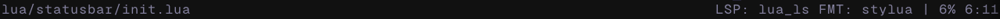

# statusbar.nvim

This is my statusbar that I use, I like it simple. I like it clean.

You are welcome to try it, and contribute. If I like it, I might just use it.

Default look:


Partial View (netrw):


## ✨ Features

- Display write status of file (RO + If Saved)
- Display lsps in use
- Display formatter and their order via [conform.nvim](https://github.com/stevearc/conform.nvim)
- Percentage of progress through files
- Line and character number

## ⚡️ Requirements

- [conform.nvim](https://github.com/stevearc/conform.nvim)

## 📦 Installation

Install the plugin with your preferred package manager:

### [lazy.nvim](https://github.com/folke/lazy.nvim)

```lua
{
  "harryvince/statusbar.nvim",
  dependencies = { "stevearc/conform.nvim" },
  opts = {}
}
```

> [!Disclaimer]
> This README was inspired by [folke](https://github.com/folke)
