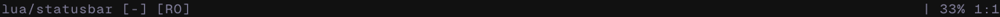

# statusbar.nvim

This is my statusbar that I use, I like it simple. I like it clean.

You are welcome to try it, and contribute. If I like it, I might just use it.

Default look:


Partial View (netrw):


## ✨ Features

- Display write status of file (RO + If Saved)
- Display lsps in use
- Display formatter and their order via [conform.nvim](https://github.com/stevearc/conform.nvim)
- Percentage of progress through files
- Line and character number

## ⚡️ Requirements

- [conform.nvim](https://github.com/stevearc/conform.nvim)

## 📦 Installation

Install the plugin with your preferred package manager:

### [lazy.nvim](https://github.com/folke/lazy.nvim)

```lua
{
  "harryvince/statusbar.nvim",
  dependencies = { "stevearc/conform.nvim" },
  opts = {
    -- your configuration comes here
    -- or leave it empty to use the default settings
    -- refer to the configuration section below
  }
}
```

## ⚙️ Configuration

Statusbar comes with the following defaults:

```lua
{
	ignoreFiles = {
		both = { "netrw", "terminal", "scratch" },
		lsp = {},
		fmt = {},
	},
}
```

## 🚀 Usage

To control wether the LSP & FMT indicator shows up this can be controlled
under the `ignoreFiles` field. If placed under both it won't be shown.

> [!Disclaimer]
> This README was inspired by [folke](https://github.com/folke)
